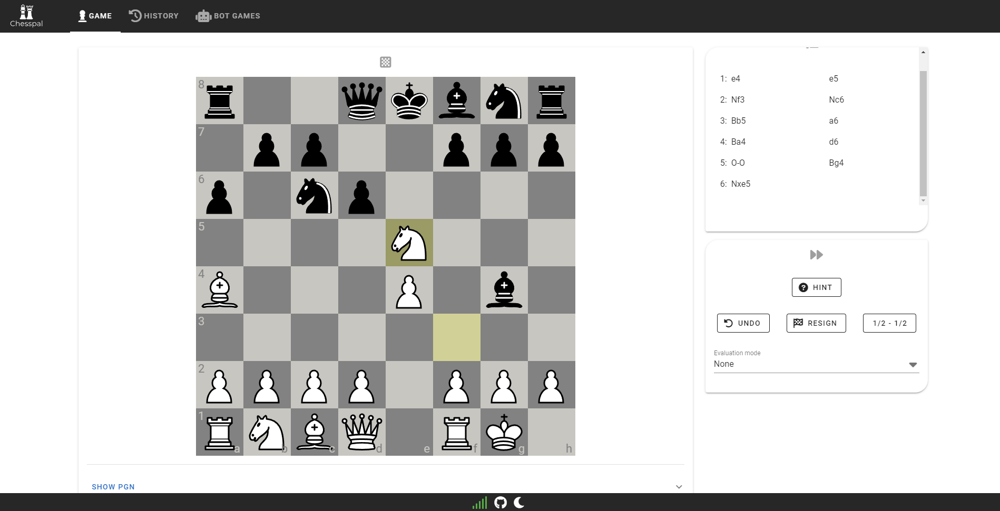
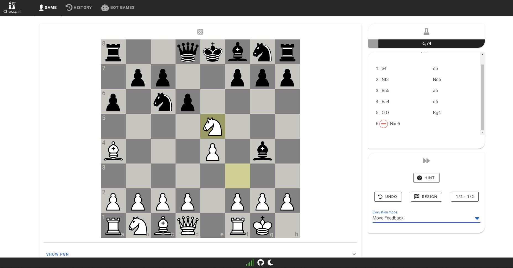
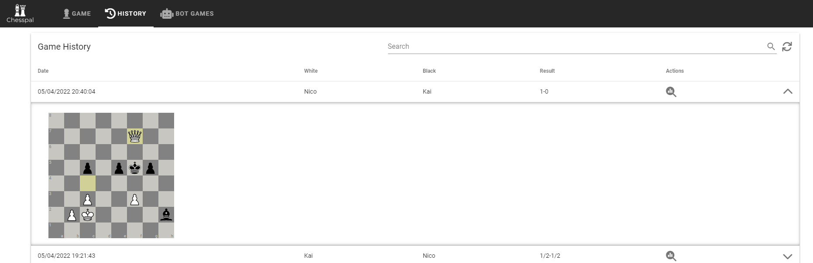

# Chesspal
Chesspal is a responsive web server for [USB DGT e-Boards](https://digitalgametechnology.com/products/home-use-e-boards). Its core features are to record chess games and play against configurable AIs. 

Special thanks to:
- @notnil ([https://github.com/notnil/chess](https://github.com/notnil/chess)) for an amazing golang based chess package that is used as a basis
- @jromang ([https://github.com/jromang/picochess](https://github.com/jromang/picochess)) for the inspiration

## Features
- runs on any hardware, including Raspberry pi
- record games played on USB DGT e-Board
- play against configurable AI
- manage played games (pgn)
- import played games on Lichess for analysis
- optional hints for best move
- undo moves
- optional evaluation of last move including "eval bar"
- use DGT e-board "upside down" (flip ranks and files)
- clients simply connect via http. You can view and manage your games on any device including smartphone







## Sever flags
| Flag | Default | Description |
| - | - | - |
| --config | ./configs/chesspal.yaml | Location of chesspals config file |

## Config file
The config file comes predefined with values suitable for a raspberry setup. You can add UCI chess engines together with UCI values to modify AIs or eval engines.

## Rclone
In order to backup all played games automatically, chesspal can run [rclone](https://rclone.org/) syncs at startup and game end. To enable this feature the config settings `rclone.games` must be set tu `true`. You can use rclone to sync the games folder with any supported remote, like Dropbox or Google Drive.

## Development
Start server:
```bash
make run
```

Start and watch frontend:
```bash
make frontend
```

Create release bundle:
```bash
make release
```

## Raspberry pi setup
The makefile ships with targets to easily setup a fresh Raspian installation. However, the arm binaries can be used for manual installation as well.

To setup a fresh Raspberry pi using makefile targets, add a `.env` based on `.env.example`. A working `golang` and `npm` setup is required. Then you can run the following commands:

```bash
make release # to generate a new release bundle locally
make raspi-install-stockfish # if you would like to use stockfish
make raspi-install-fairy-stockfish # if you would like to use fairy-stockfish
make raspi-install-chesspal
make raspi-install-rclone # if you would like to use rclone
```

To debug the installation you can have a look into the logs
```bash
make raspi-logs-all
```
